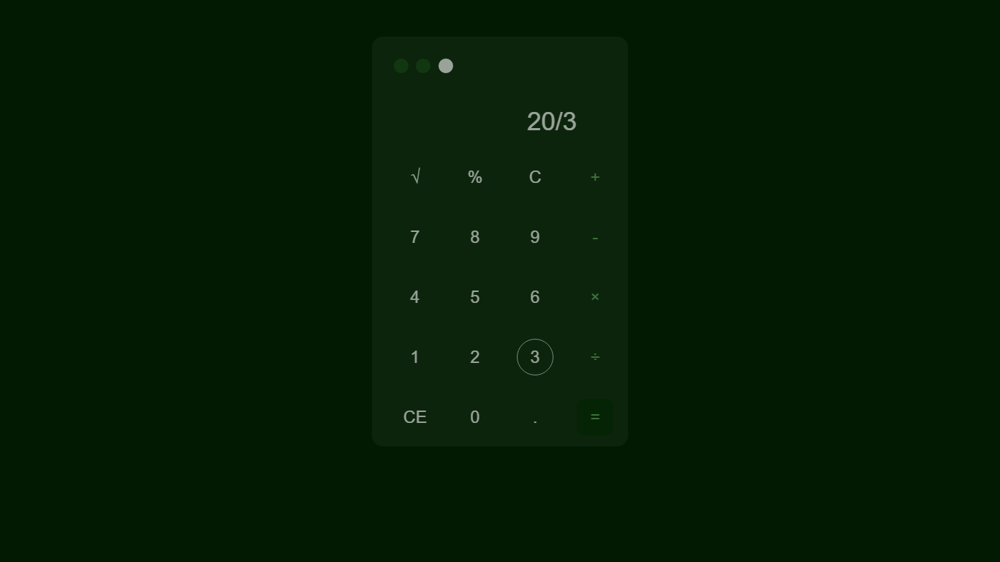
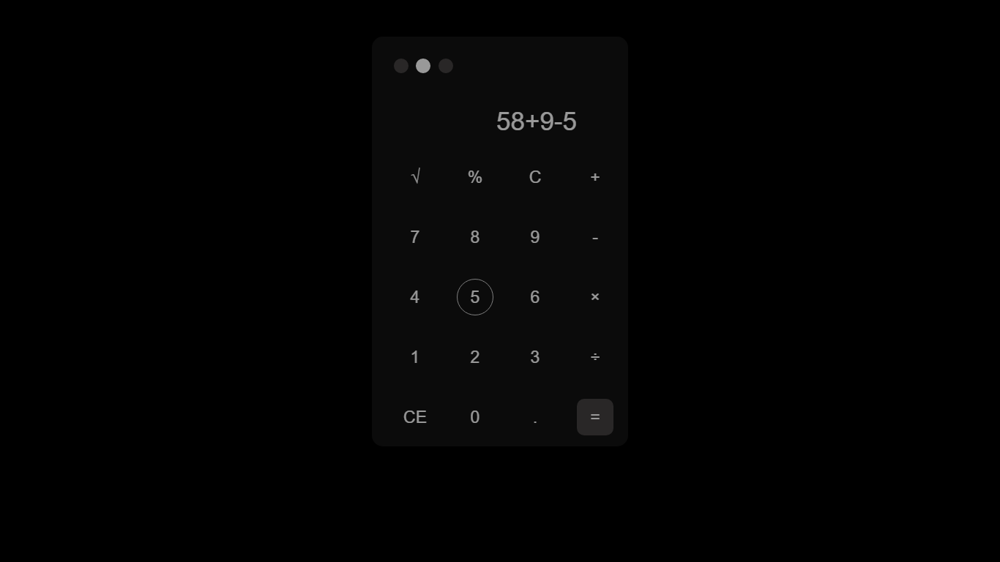

# Frontend Mentor - Calculator app solution

This is a solution to the [Calculator app challenge on Frontend Mentor](https://www.frontendmentor.io/challenges/calculator-app-9lteq5N29). Frontend Mentor challenges help you improve your coding skills by building realistic projects. 

## Table of contents

- [Overview](#overview)
  - [The challenge](#the-challenge)
  - [Screenshot](#screenshot)
  - [Links](#links)
  - [Built with](#built-with)
  - [Continued development](#continued-development)
- [Author](#author)

## Overview

### The challenge

Users should be able to:

- See the size of the elements adjust based on their device's screen size
- Perform mathmatical operations like addition, subtraction, multiplication, and division
- Adjust the color theme based on their preference
- **Bonus**: Have their initial theme preference checked using `prefers-color-scheme` and have any additional changes saved in the browser

### Screenshot

### Links

- Solution URL: (https://github.com/Egwolor/Javascript-Calculator)
- Live Site URL: (https://egwolor.github.io/Javascript-Calculator/)

## My process

### Built with

- Semantic HTML5 markup
- CSS custom properties
- HTML tables
- Mobile-first workflow
- vanilla js

### Continued development

In later times i would add trig performance and other fucnctions to its ability  and  hope it will be very much available to the public

## Author

- Frontend Mentor - [@Egwolor](https://www.frontendmentor.io/profile/Egwolor)
- Twitter - [@Target_IV](https://www.twitter.com/Target_IV)

